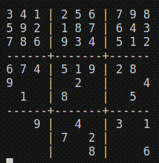

# Sudoku Solver (9x9)

A Python program designed to solve 9x9 Sudoku puzzles. Users can define the Sudoku puzzle to be solved in a .txt file, and if visualization is enabled, the solving process will be displayed in the terminal.



## File Format

To ensure the program can correctly read and solve the Sudoku puzzle, please adhere to the following format in the .txt file:

- Represent unknown values with a zero.
- Each row of the Sudoku puzzle should be on a new line.
- Columns should not have any separation between them.

### File Format Example
```
020030090
000907000
900208005
004806500
607000208
003102900
800605007
000309000
030020050
```

## Usage

To use the Sudoku solver, run the following command in your terminal:
```
python sudoku_solver.py [-h] [-p PATH] [-v]
```

### Options

- `-h`, `--help` Show this help message and exit.
- `-p PATH`, `--path PATH` Path to the .txt file containing the Sudoku puzzle. Default: `sudoku.txt`
- `-v`, `--visualize` Enable visualization of the solving process in the terminal. Default: `False`